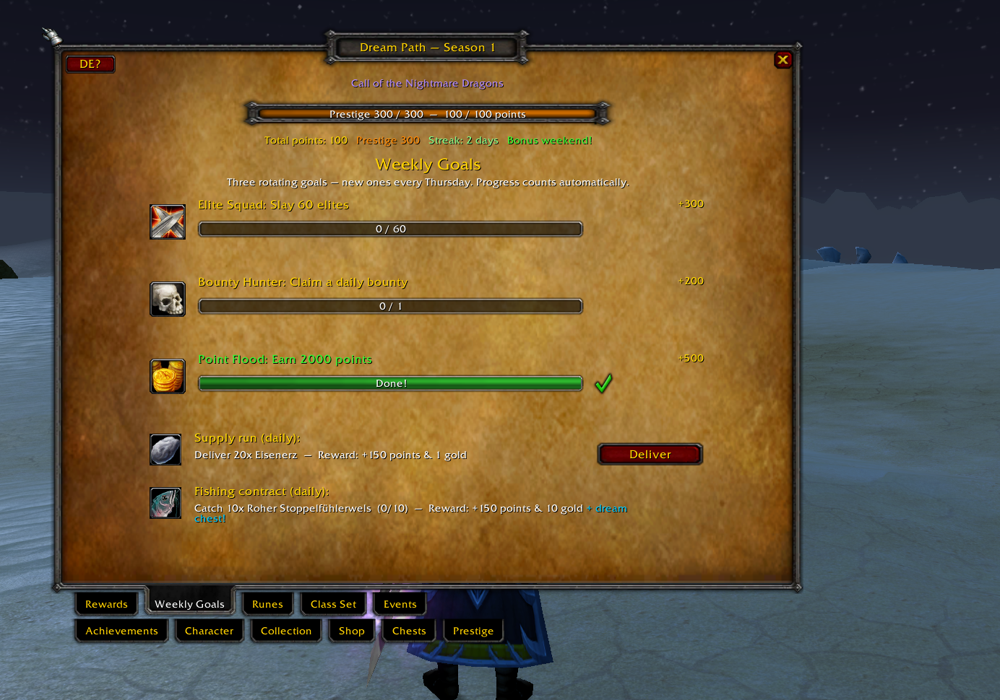
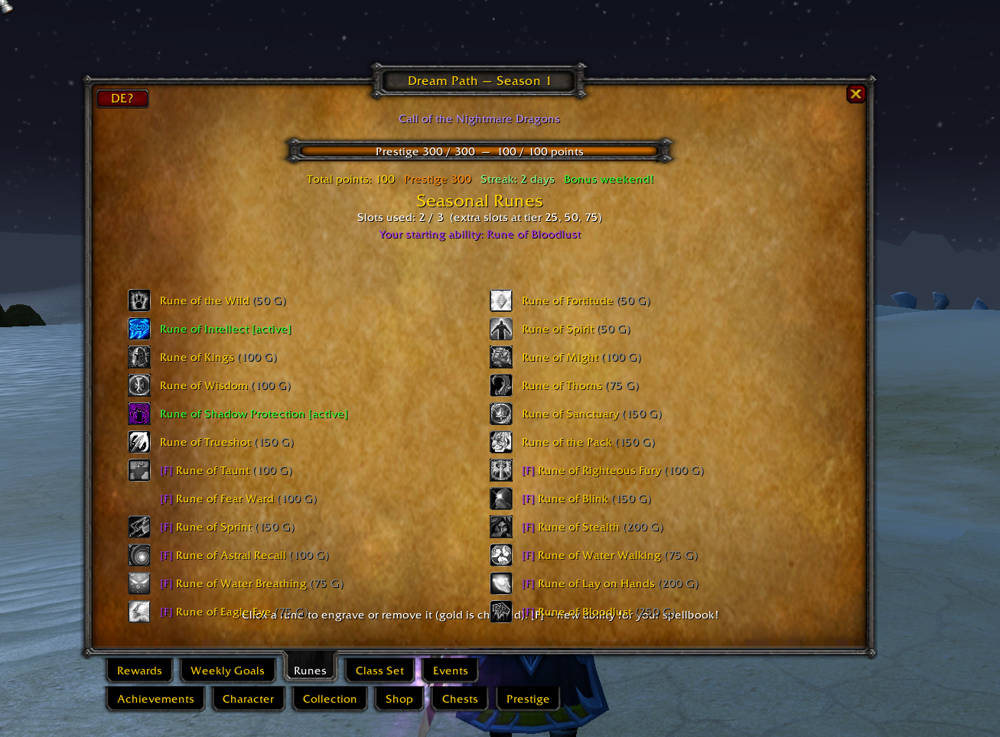
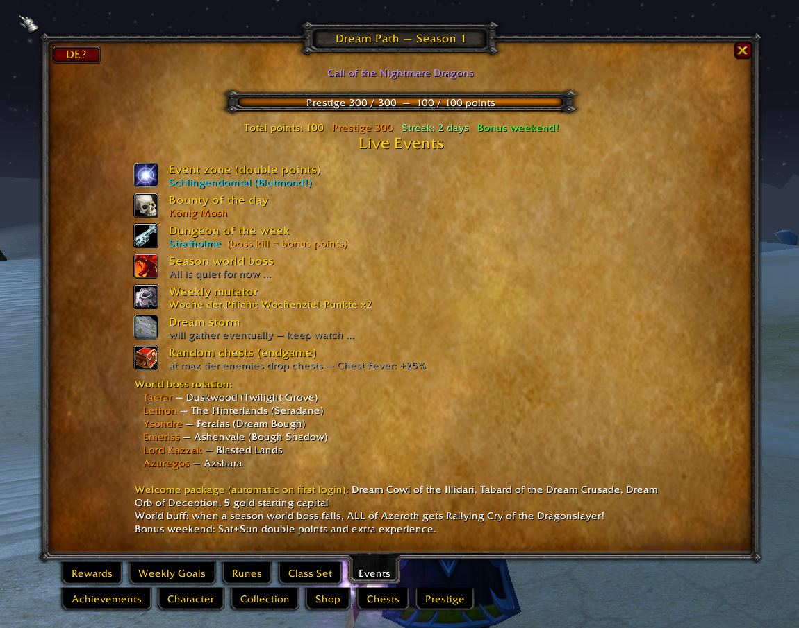
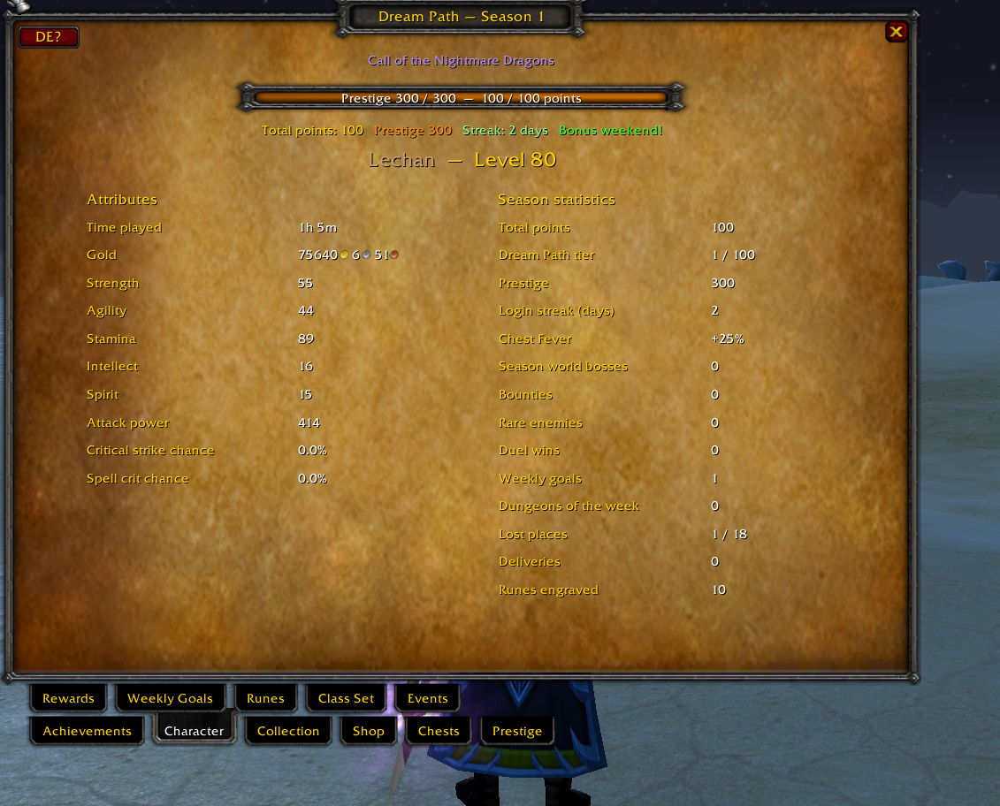
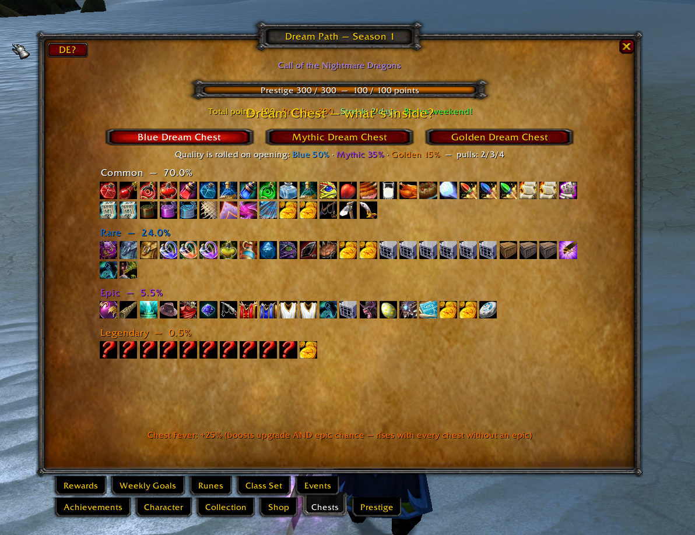
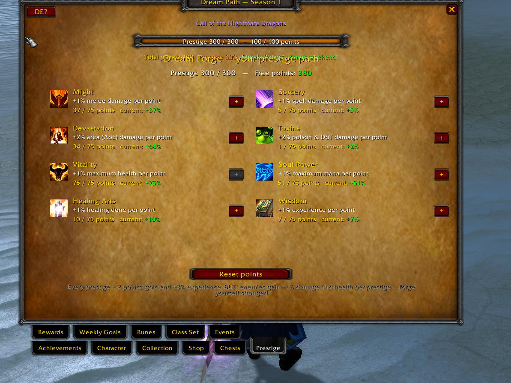
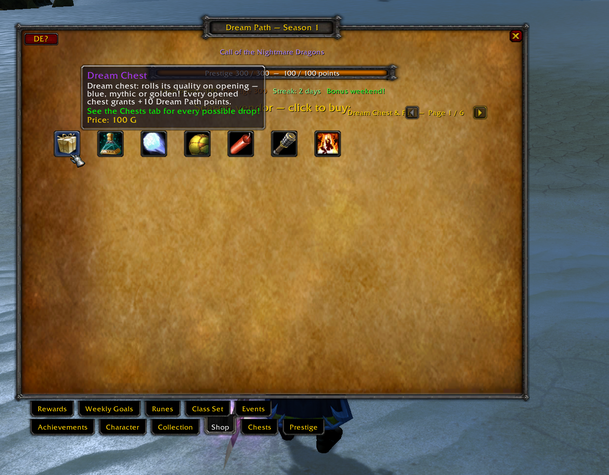
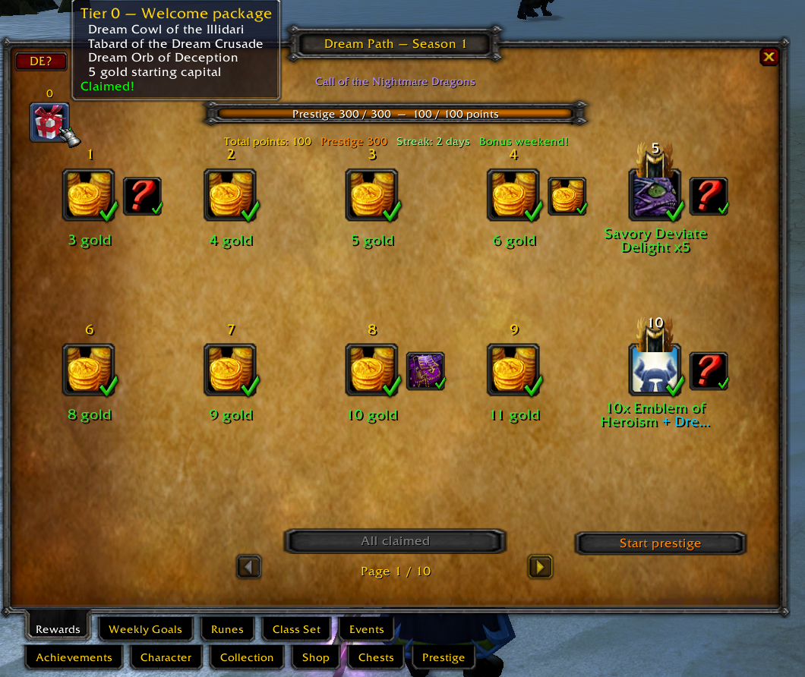
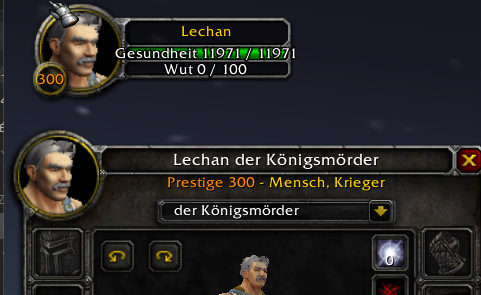

# mod-seasonpass — Traumpfad (Dream Path)

**Ein kompletter, kostenloser Season Pass für AzerothCore (WotLK 3.3.5a) mit vollwertigem Ingame-UI-Addon.**

🇬🇧 **[English version → README.md](README.md)**

> ⚠️ **ALPHA-TEST** — dieses gesamte Projekt ist **an einem einzigen Tag** entstanden, als Experiment
> (AI-Pair-Programming mit Claude von Anthropic). Es läuft auf unserem Privatserver, aber rechnet mit
> Ecken, Kanten, Balance-Eigenheiten und dem einen oder anderen drachengroßen Bug. Feedback ist herzlich willkommen!

---

## Was ist das?

Der **Traumpfad** macht aus deinem 3.3.5a-Privatserver einen Saison-Server im Geiste von
**Classic+ / Season of Discovery**: ein Season Pass mit 100 Stufen, klassenübergreifende Fähigkeits-Runen,
rotierende Weltinhalte, Mystery-Kisten mit Live-Aufwertungs-Animation und ein **Prestige-/Paragon-Endgame
im Diablo-Stil bis Prestige 300** mit mitskalierenden Gegnern.

Alles ist **100 % kostenlos** (kein Premium-Pfad — beide Belohnungspfade stehen allen offen), der gesamte
Fortschritt ist **charaktergebunden**, und alles läuft über eine **echte Klick-UI** — keine NPCs nötig.
Die komplette Oberfläche ist **zweisprachig (Deutsch / Englisch)** mit dauerhaft gespeichertem Sprachumschalter.

Saison 1: **„Ruf der Alptraumdrachen"** (*Call of the Nightmare Dragons*).

## Screenshots

| Belohnungen & Saisonleiste | Wochenziele | Runen |
|---|---|---|
|  |  |  |

| Live-Events | Charakter | Kisten |
|---|---|---|
|  |  |  |

| Prestige (Traumschmiede) | Shop | Willkommenspaket |
|---|---|---|
|  |  |  |

| Prestige ersetzt die Levelanzeige — Porträt & Charakterfenster |
|---|
|  |

---

## Feature-Überblick — wirklich alles

Das Addon-Fenster hat **11 Tabs**:

| Tab | Was er kann |
|---|---|
| **Belohnungen** | 100 Stufen, zwei parallele Pfade (Abenteuer + Helden — **beide gratis**), Klick zum Abholen, Stufe-0-Willkommenspaket |
| **Wochenziele** | 3 rotierende Ziele aus 40 Definitionen, Wochen-Reroll („Traumtausch"), täglicher Versorgungsauftrag, täglicher Angelauftrag |
| **Runen** | 12 Dauerbuff-Runen + 12 **klassenfremde Fähigkeits-Runen** (SoD-Stil), Startfähigkeiten-Auswahl |
| **Klassenset** | Ein episches 4-Teile-Set pro Klasse, das **von Level 1 bis 80 mitlevelt** (Erbstück-Kurve), ohne Kenntnisse tragbar |
| **Events** | Live-Ansicht: Eventzone, Kopfgeld des Tages, Dungeon der Woche, Weltboss, Wochen-Mutator, Traumsturm |
| **Erfolge** | 24 Saison-Erfolge mit Fortschrittsbalken |
| **Charakter** | Spielzeit, Gold, Attribute, Krit — plus 14 Saison-Statistiken |
| **Sammlung** | Saison-Journal: Haustiere & Cosmetics mit Besitz-Häkchen |
| **Shop** | Saisonhändlerin mit ~118 kuratierten Items auf 6 Kategorie-Seiten + der Traumkiste |
| **Kisten** | Komplette Beutevorschau mit **exakten Drop-Chancen** für jedes mögliche Item |
| **Prestige** | Die Traumschmiede: Paragon-Punkte auf 8 Werte verteilen |

Dazu: eine **Saisonleiste** über der Aktionsleiste (Traumpfad-Fortschritt + Charakterlevel), ein
**Minimap-Drachenknopf**, Levelup-Fanfaren mit Banner und eine **Kistenöffnungs-Animation** in der Bildschirmmitte.

### Der Saison-Pass

- **100 Stufen**, 100 Punkte pro Stufe. Zwei Pfade, beide gratis: der Abenteuerpfad (Gold, Kisten, Pets,
  Spielzeuge, Embleme, Titel wie *Jenkins* und *Königsmörder*) und der Heldenpfad (Klassenset-Teile,
  Wappenröcke, größere Goldpakete).
- **Willkommenspaket** auf Stufe 0 für jeden Charakter: Traumkrone der Illidari (Schwarzer-Tempel-Look!),
  Wappenrock des Traumkreuzzugs, Traumkugel der Täuschung, 5 Gold Startkapital.
- **Punkte gibt es für alles**: Quests, Kills, Elites, Rares, Dungeonbosse, Levelaufstiege, Duelle,
  Entdeckungen (18 verlorene Orte), täglicher Login (mit Serien-Bonus), Wochenziele, Weltbosse,
  Lieferungen, Angeln — und jede geöffnete Kiste.
- Punkte-Multiplikatoren: **Bonus-Wochenende** (Sa+So), **Eventzone** (x2), **Traumsturm** (x3 für
  15 Minuten), wöchentliche **Mutatoren** (8 rotierende Wochen-Modifikatoren wie „Questpunkte x2"),
  Prestige-**Saison-Erbe**.

### Traumkisten 📦

Es gibt **eine** Kiste: die **Traumkiste**. Beim Öffnen wird ihre Qualität live ausgewürfelt — mit
Animation in der Bildschirmmitte (Farben rotieren, dann rastet die Qualität ein):

- 🔵 **Blau** (50 %) → 2 Ziehungen &nbsp; 🟣 **Mythisch** (35 %) → 3 Ziehungen &nbsp; 🟠 **Golden** (15 %) → 4 Ziehungen
- **Kistenfieber** (Pity-System): Jede Kiste ohne Episches erhöht Aufwertungs- *und* Episch-Chance der nächsten.
- Kuratierter **100-Einträge-Beutepool** in 4 Raritäten: Verbrauchsgüter & Spaß-Items (inklusive bewusster
  Nieten wie einer Angel), Haustiere, Fläschchen, Taschen, Kult-Cosmetics (Kugel der Täuschung, Don Carlos'
  Hut, Flagge des Besitzanspruchs, Arkanitangelrute …), Gold bis zum 500-G-Jackpot, die **Verlorene Rune**
  (lehrt sofort eine zufällige unbekannte Fähigkeits-Rune) — und die **einzige Mount-Quelle**: ultraseltene
  anforderungsfreie Klone von Unbesiegbar, Mimirons Kopf, Asche von Al'ar, dem Alptraumdrachen und mehr.
  Legendäre Züge werden serverweit angesagt!
- Jede geöffnete Kiste gibt **+10 Saisonpunkte** und zählt für 2 Kisten-Erfolge.
- Kisten droppen im Endgame/Prestige-Modus von Gegnern, kommen aus dem Pass, dem Shop (100 G) und dem
  täglichen Angelauftrag. Der **Kisten-Tab** zeigt jeden möglichen Drop mit exakter Prozentchance.

### Saison-Runen (SoD-Stil)

- **12 Dauerbuff-Runen** — bewusst mild (max ~10 %: Segen der Könige +10 % Werte, Zielsicherheit +10 % AP,
  Anführer des Rudels +5 % Krit, Refugium −3 % erlittener Schaden, dazu Rang-1-Klassiker). Die Auren laufen nie ab.
- **Runenresonanz**: Jede gravierte Buff-Rune gibt zusätzlich **+2 % Schaden, +2 % Leben, +2 % Heilung**.
- **12 Fähigkeits-Runen**, die JEDER Klasse echte Zauber beibringen: Spott, Zorn der Gerechtigkeit,
  Furchtzauberschutz, Blinzeln, Sprint, Schleichen, Astrale Rückkehr, Wasserwandeln, Wasseratmung,
  Handauflegung, Adlerauge, Kampfrausch.
- 3 Runenslots, +1 auf Stufe 25 / 50 / 75. Gravieren kostet Gold, Entfernen ist gratis.
- **Startfähigkeit**: Jeder Charakter wählt einmalig eine kostenlose klassenfremde Fähigkeit.

### Prestige & die Traumschmiede (Paragon-Endgame)

- Stufe 100 erreichen → Prestige. Ab dann gilt: **alle 100 Punkte = direkt +1 Prestige-Level** (keine
  Stufen mehr dazwischen), bis **Prestige 300**.
- Jedes Prestige: **+2 Traumschmiede-Punkte**, Gold, **+3 % dauerhafte Erfahrung** — und eine Fanfare.
- **8 Paragon-Werte** (Cap je 75 — du kannst nicht alles maxen, wähle deinen Build!): Nahkampfschaden,
  Zauberschaden, **Flächenschaden**, **Gift-/DoT-Schaden**, maximales Leben, maximales Mana, Heilung,
  Erfahrung. Kostenloser Reset jederzeit.
- **Die Gegner skalieren mit**: Pro Prestige-Level machen Monster +1 % Schaden und haben +1 % effektives
  Leben. Bei P300 sind sie 4× so zäh — dein Paragon-Build, dein Gear und deine Runen sind die Antwort.
- Prestige **ersetzt die Levelanzeige**: Porträtring, Charakterfenster und Saisonleiste zeigen deinen
  Prestige-Level in Paragon-Orange. Jedes 10. Prestige wird serverweit angesagt.

### Lebendige Weltinhalte

- **Eventzone** (rotiert alle 3 h, doppelte Punkte), **Kopfgeld des Tages** (Klassiker-Elites wie Hogger
  mit eigener Ansage), **Dungeon der Woche** (Bonuspunkte für Bosskills).
- **Weltboss-Rotation** (6 Bosse: die vier Smaragddrachen an ihren echten Portalen, Lord Kazzak, Azuregos):
  Stirbt einer, bekommt **der ganze Server** den *Schlachtruf des Drachentöters*.
- **Wochen-Mutatoren** (8) und der Überraschungs-**Traumsturm** (x3 Punkte für 15 Minuten, stündliche Chance).
- **Tägliche Versorgungsaufträge** (Waylaid-Supplies-Hommage, 21 rotierende Handelswaren) und ein
  **täglicher Angelauftrag** (fang 10 vom Tagesfisch → 150 Punkte, 10 Gold und eine Bonus-Traumkiste —
  zählt beim Angeln vollautomatisch).

### Komfort

- Alle Custom-Items sind **anforderungsfreie Klone** — nutzbar ab Level 1, Mounts ohne Reitskill,
  Klassensets ohne Rüstungs-/Waffenkenntnis.
- Fortschritt ist **komplett charaktergebunden** (pro GUID), neue Charaktere starten bei 0.
- Icon-Vorladen gegen die „?"-Icon-Probleme des 3.3.5-Clients, Tooltips überall, exakte Chancen sichtbar.

---

## Wie es funktioniert (Architektur)

```
gen_season.py  ──►  16 SQL-Dateien (World-DB)  ──►  automatisch vom AzerothCore-Modul-Updater angewendet
      │
      └──────►  SeasonPassUI/SeasonPassData.lua  (Addon-Daten — immer synchron zur DB)

mod-seasonpass/src/   C++-Modul (2 Skripte + Header, keine CMakeLists nötig)
SeasonPassUI/         3.3.5a-Client-Addon (pures Lua, keine Bibliotheken)
```

- **Ein Generator, eine Wahrheit**: `gen_season.py` erzeugt SQL-Inhalte *und* Addon-Datendatei gleichzeitig —
  Server und UI können nie auseinanderlaufen. Saison dort anpassen, laufen lassen, neu ausrollen.
- **Server ⇄ Addon-Sync** läuft über versteckte Chat-Systemmeldungen (`BPSYNC`, `BPWK`, `BPRN`, `BPEV`,
  `BPACH`, `BPSUP`, `BPFI`, `BPPG`, `BPCHEST`), die das Addon aus dem Chat filtert; zurück gehen unsichtbare
  `.bp`-Befehle. Keine eigenen Opcodes, keine Core-Änderungen.
- Das gesamte Modul-SQL ist **idempotent** (sicher für den automatischen Modul-Updater — die
  Charakter-Tabellen migrieren sich selbst).
- Rotationen (Eventzone, Kopfgeld, Dungeon, Mutator, Lieferungen, Fisch, Sturm) sind **deterministisch aus
  der Uhrzeit** berechnet — Neustarts ändern nichts, alle Spieler sehen dieselbe Welt.

## Installation (AzerothCore)

**Voraussetzungen:** ein [AzerothCore](https://github.com/azerothcore/azerothcore-wotlk)-Server (WotLK 3.3.5a).
Entwickelt und getestet gegen den [Playerbot-Fork](https://github.com/liyunfan1223/azerothcore-wotlk) im
Juli 2026 — aktuelles Master sollte ebenfalls laufen (Hook-Signaturen können leicht abweichen; Fixes sind
meist Einzeiler).

### 1. Server-Modul

```bash
cd /pfad/zu/azerothcore/modules
git clone https://github.com/teodorgross/mod-seasonpass.git mod-seasonpass
cd ../build
cmake .
make -j$(nproc) && make install
```

*(Das Repo enthält auch Addon und Generator — der Server kompiliert nur `mod-seasonpass/`.)*

### 2. Datenbank

Nichts zu tun 🎉 — der Modul-SQL-Updater von AzerothCore wendet beim nächsten Worldserver-Start alles in
`mod-seasonpass/data/sql/` automatisch an (World-Inhalte + selbstmigrierende Charakter-Tabellen).

### 3. Client-Addon

Den Ordner **`SeasonPassUI`** in den 3.3.5a-Client kopieren:

```
World of Warcraft/Interface/AddOns/SeasonPassUI
```

Einloggen, Drachenknopf an der Minimap (oder die Saisonleiste) anklicken — fertig.

### 4. Optionale Konfiguration

Alle Optionen leben in der `worldserver.conf` — jeder Schlüssel hat einen sinnvollen Standard, das Modul
läuft ganz ohne Konfiguration:

| Schlüssel | Standard | Bedeutung |
|---|---|---|
| `SeasonPass.Enable` | 1 | Hauptschalter |
| `SeasonPass.PointsPerTier` | 100 | Punkte pro Stufe / pro Prestige-Level |
| `SeasonPass.MaxTier` | 100 | Stufen pro Saison |
| `SeasonPass.Points.Quest/Kill/EliteKill/BossKill/RareKill/LevelUp/DailyLogin` | 10/1/5/100/25/50/50 | Punktquellen |
| `SeasonPass.Chest.Enable` | 1 | Traumkisten |
| `SeasonPass.Chest.PityStepPct` | 5 | Kistenfieber-Schritt je Kiste ohne Episches |
| `SeasonPass.Prestige.Max` | 300 | Prestige-Obergrenze |
| `SeasonPass.Prestige.XPPctPerLevel` | 3 | Dauerhafter XP-Bonus je Prestige |
| `SeasonPass.Prestige.AutoGold` | 100000 | Kupfer je Auto-Prestige-Level |
| `SeasonPass.Paragon.PointsPerPrestige` | 2 | Traumschmiede-Punkte je Prestige |
| `SeasonPass.Paragon.CapPerStat` | 75 | Paragon-Cap je Wert |
| `SeasonPass.Paragon.MobScalePctPerPrestige` | 1 | Gegnerskalierung je Prestige |
| `SeasonPass.Runes.ResonancePct` | 2 | Runenresonanz je gravierter Buff-Rune |

### Befehle

Spieler brauchen keine Befehle (die UI sendet sie unsichtbar), aber es gibt sie:
`.bp` (Status), `.bp claim`, `.bp weekly`, `.bp reroll <slot>`, `.bp rune <id>`, `.bp buy <slot>`,
`.bp welcome`, `.bp deliver`, `.bp startrune <id>`, `.bp prestige ja|yes`, `.bp paragon <1-8> [n]`,
`.bp paragon reset`, `.bp lang <de|en>`, `.bp sync` — nur GM: `.bp addpoints <n>`, `.bp chest <0-3>`.

### Eine eigene Saison bauen

**`gen_season.py`** anpassen (Belohnungen, Kisten-Loot, Runen, Shop, Bosse — sämtliche Inhalte stehen dort), dann:

```bash
python gen_season.py
```

SQL-Ordner und Addon-Ordner neu ausrollen — das ist die gesamte Content-Pipeline.
Für Saison 2: `SEASON = 2` im Generator und `SeasonPass.Season = 2` in der Config.

---

## Alpha-Hinweise / bekannte Einschränkungen

- An einem Tag gebaut — bitte als **spielbaren Prototyp** verstehen, nicht als fertiges Produkt.
- Der Sammlungs-Besitz wird über Taschen+Bank geprüft: ein bereits *benutztes* Pet zählt als „fehlend".
- Einzelne TCG-/Jubiläums-Item-IDs existieren nicht auf jeder DB — der Server überspringt sie beim
  Würfeln automatisch.
- Balance-Werte (Punkte, Preise, Chancen, Gegnerskalierung) sind erste Entwürfe. In der Config nachjustieren!

## Credits & Dankeschön ❤️

- **[AzerothCore](https://github.com/azerothcore/azerothcore-wotlk)** und alle Mitwirkenden — der beste
  Open-Source-WotLK-Core, den es gibt. Dieses Modul ist Gast in ihrem Haus. Danke!
- **[liyunfan1223](https://github.com/liyunfan1223)** und die
  **[mod-playerbots](https://github.com/liyunfan1223/mod-playerbots)**-Community — der Playerbot-Fork,
  auf dem das hier gebaut und getestet wurde. Danke!
- Die **Classic+ / Season-of-Discovery**-Community, deren Wunschlisten die Hälfte dieser Features
  inspiriert haben.
- An einem einzigen Tag gebaut, gemeinsam mit **Claude (Anthropic)** als AI-Pair-Programming-Experiment.
- World of Warcraft® und Blizzard Entertainment® sind Marken von Blizzard Entertainment, Inc.
  Dies ist ein nicht-kommerzielles Fan-Projekt für Privat-/Lernserver.

## Lizenz

Veröffentlicht unter der **GNU AGPL v3** — derselben Lizenz wie AzerothCore. Siehe [LICENSE](LICENSE).
